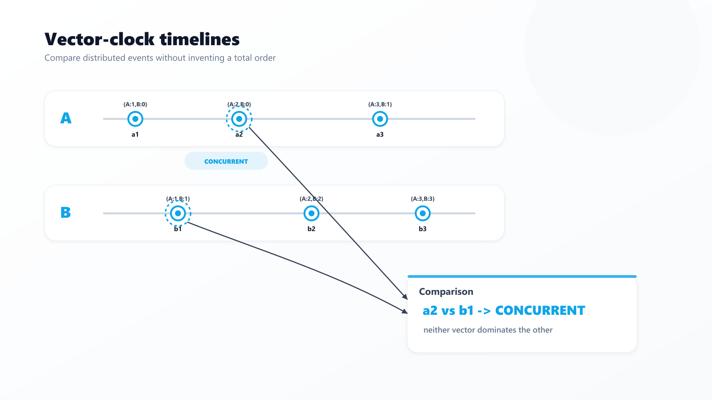
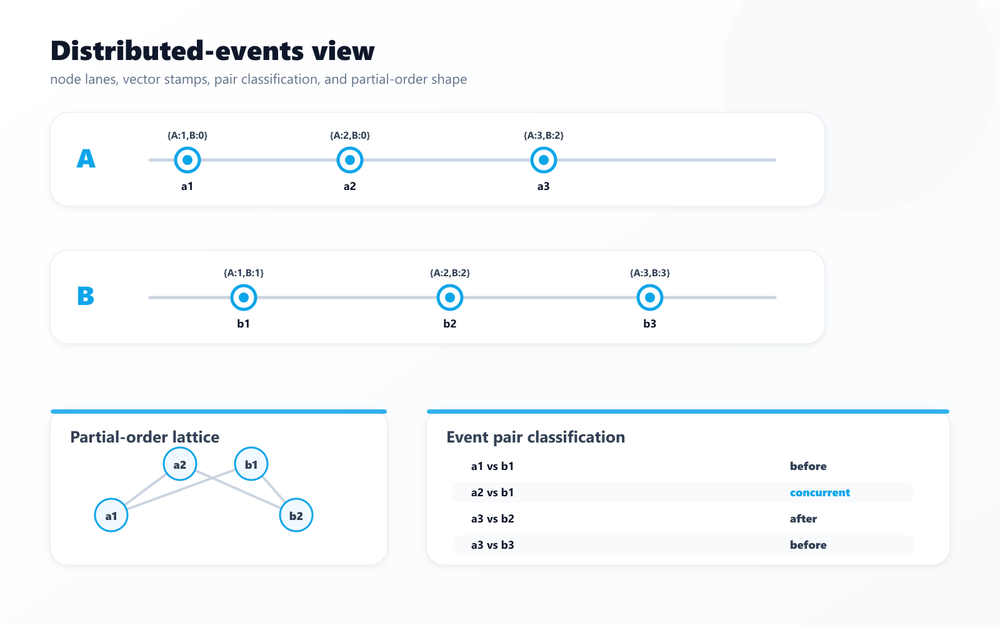
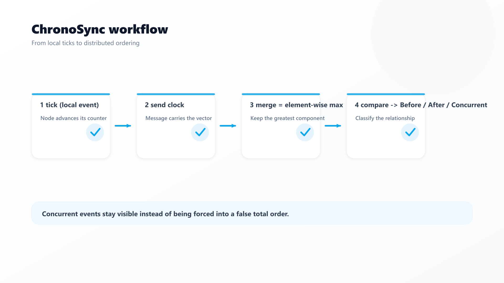
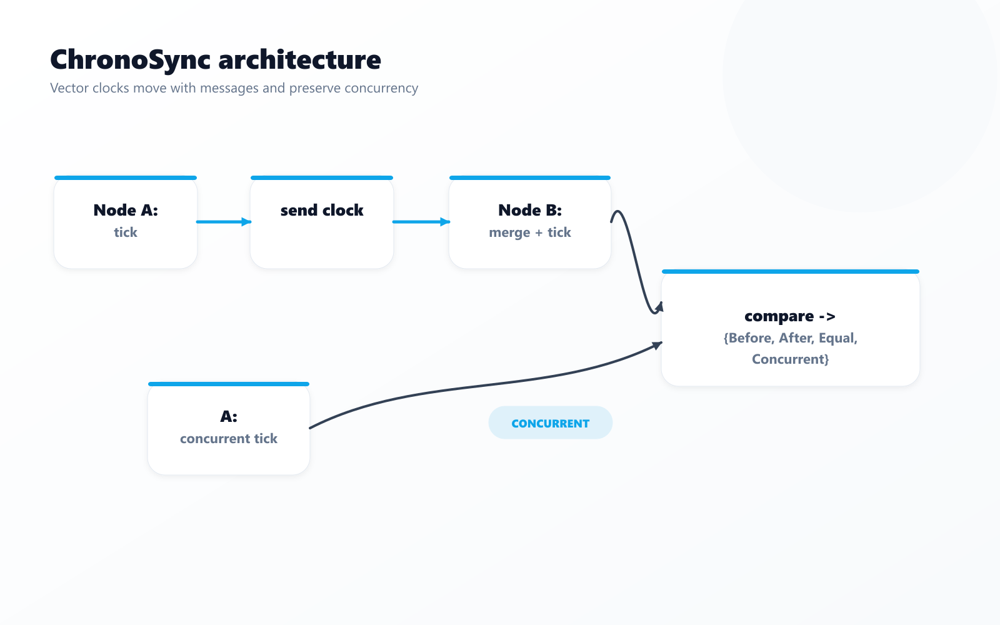
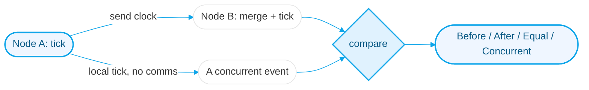

# ChronoSync
### Vector clocks in Rust — order distributed events causally, and detect the concurrent ones, with no global clock.


## 📖 Overview



In a distributed system there is no reliable global clock, so "which event happened first?" can't be
answered with timestamps. **Vector clocks** solve it: each node keeps a per-node counter, and comparing
two clocks tells you whether one event **happened-before** another, they're **equal**, or they're
**concurrent** — the case a single scalar clock (like Lamport's) can't express.

ChronoSync is a small, dependency-free Rust library implementing this correctly, with property-style tests
and a runnable demo of nodes exchanging messages.

> Part of my Senior Hybrid Engineer 2026 portfolio (`#52`). Distributed-systems fundamentals, and my first
> Rust project — memory-safe, zero-dependency, provable with tests.

## 🚀 Quick Start
```bash
git clone https://github.com/Kimosabey/chrono-sync.git
cd chrono-sync

cargo test   # 7 tests (5 unit + 2 integration)
cargo run    # demo: two nodes exchange messages; shows before / concurrent / after
```

### Demo output
```
a1 vs b1: happened-before     # B received A's message, then acted
a2 vs b1: CONCURRENT          # A acted again without hearing from B
a2 vs b2: happened-before     # B later merged A's state
```

### API
```rust
use chrono_sync::{VectorClock, Causality};

let mut a = VectorClock::new();
a.tick("A");                 // local event
let snapshot = a.clone();

let mut b = VectorClock::new();
b.merge(&snapshot);          // receive A's clock
b.tick("B");                 // local event

assert_eq!(snapshot.compare(&b), Causality::Before);
```

## ✨ Key Features



- **Causal comparison** — `Before` / `After` / `Equal` / `Concurrent` (not just a total order).
- **`tick` / `merge`** — the local-event and message-receive primitives, done correctly (element-wise max).



- **Concurrency detection** — surfaces causally-independent events (the basis for conflict detection in CRDTs, Dynamo-style stores, etc.).
- **Zero dependencies**, memory-safe Rust; 7 tests including a 3-node gossip and a partition scenario.

## 🏗️ Architecture




The subtlety is the **`Concurrent`** case: two clocks are concurrent when neither dominates the other on
every component. See [docs/ARCHITECTURE.md](./docs/ARCHITECTURE.md).

## 🧰 Tech Stack
| Layer | Technology | Role |
| :--- | :--- | :--- |
| Language | Rust 1.97 (edition 2021) | Memory-safe, zero-dependency core |
| Structure | `lib` + `bin` | Library API + runnable demo |
| Tests | `cargo test` | 5 unit + 2 integration |

## 📚 Documentation
- [Architecture](./docs/ARCHITECTURE.md) — vector-clock semantics, the concurrent case, comparisons to Lamport clocks
- [Getting Started](./docs/GETTING_STARTED.md) · [Failure Scenarios](./docs/FAILURE_SCENARIOS.md) · [Interview Q&A](./docs/INTERVIEW_QA.md)

## 🔭 Future Enhancements
- Serialize/deserialize clocks (serde) for on-the-wire use
- Bounded/pruned clocks for large node sets
- A CRDT (e.g. LWW-register / OR-set) built on top
- Benchmarks vs. Lamport clocks

## 📄 License
Released under the MIT License.

## 👤 Author

**Harshan Aiyappa**
Senior Full-Stack Hybrid AI Engineer
Voice AI • Distributed Systems • Infrastructure

[](https://kimo-nexus.vercel.app/)
[](https://github.com/Kimosabey)
[](https://linkedin.com/in/harshan-aiyappa)
[](https://x.com/HarshanAiyappa)
