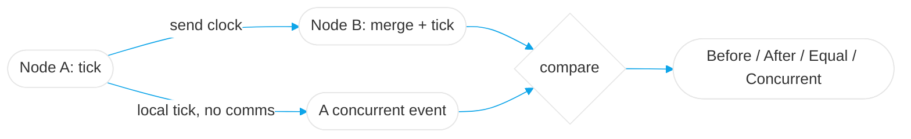

# Architecture — ChronoSync

## High-Level Design (HLD)
ChronoSync implements **vector clocks** so distributed nodes can establish the causal ordering of events
without a synchronized global clock — and, crucially, detect **concurrent** events (which a scalar/Lamport
clock cannot distinguish from ordered ones).

## Low-Level Design (LLD)
- **`VectorClock`** — wraps a `BTreeMap<String, u64>` (node id → counter). Missing nodes read as `0`.
  - `tick(node)` — increment this node's own counter (a local event).
  - `merge(&other)` — element-wise **max** of both maps (the message-receive step).
  - `compare(&other) -> Causality` — scans the union of node ids, tracking whether `self` is ever *less*
    and ever *greater* than `other`.
- **`Causality`** — `Before | After | Equal | Concurrent`.

### The comparison rule
| some component `self < other` | some component `self > other` | result |
|:--:|:--:|:--|
| no | no | `Equal` |
| yes | no | `Before` |
| no | yes | `After` |
| yes | yes | `Concurrent` |

## Decision Log
- **Rust** — a memory-safe, zero-dependency core; the algorithm's correctness is provable with tests and there's no GC to reason about.
- **`BTreeMap` over `HashMap`** — deterministic key ordering makes clock output stable and diffs readable (helps tests and debugging).
- **Explicit `Concurrent` variant** — rather than implementing `PartialOrd` (which would collapse "concurrent" into `None`), an explicit enum makes the concurrency case a first-class, named outcome.

## Concept Deep Dive
The subtlety is the **concurrent** case: two clocks are concurrent when neither dominates the other on
*every* component (each has seen something the other hasn't). That is exactly the signal downstream
systems use to detect conflicting writes — the foundation for CRDTs and Dynamo-style eventual consistency.
